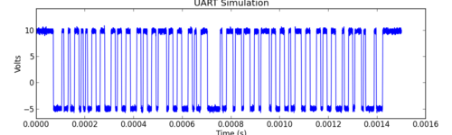
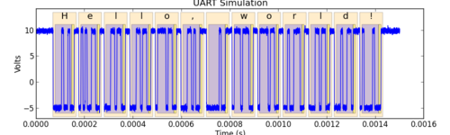

.. Ripyl documentation master file, created by
   sphinx-quickstart on Tue Mar 12 17:53:08 2013.
   You can adapt this file completely to your liking, but it should at least
   contain the root `toctree` directive.

Ripyl library documentation
===========================

Ripyl is a library for decoding serialized data collected from an oscilloscope
or logic analyzer. It supports a variety of protocols and can be readily extended
with new protocols. Ripyl is useful for offline decoding of data collected on
instruments with no built in support for decoding or lacking support for more
advanced protocols.

It can process a waveform like this:

... and produce an annotated result like this:

Using Ripyl is as simple as follows:

.. code-block:: python

    import ripyl
    import ripyl.protocol.uart as uart
    
    raw_samples, sample_period = read_samples_from_your_oscilloscope()
    txd = ripyl.streaming.samples_to_sample_stream(raw_samples, sample_period)
    records = list(uart.uart_decode(txd, bits=8, parity='even', stop_bits=1))

The library provides decoded information in an easily traversed tree detailing the time and data for each sub-element of a protocol transmission. In the example above you can see the individual frames along with the highlighted data and parity bits within each frame. The status of parity is verified as are checksums and CRCs used in other protocols.

Features include:
    * Multi-protocol support:
        ======================= ========================== ======================= ========================
        :ref:`CAN <can>`        :ref:`Ethernet <ethernet>` :ref:`HSIC <hsic>`      :ref:`I2C <i2c>`
        :ref:`J1850 <j1850>`    :ref:`LIN <lin>`           :ref:`ISO 9141 <kline>` :ref:`ISO 14230 <kline>`
        :ref:`NEC <nec>`        :ref:`PS/2 <ps2>`          :ref:`RC5 <rc5>`        :ref:`RC6 <rc6>`
        :ref:`SIRC <sirc>`      :ref:`SPI <spi>`           :ref:`UART <uart>`      :ref:`USB 2.0 <usb>`
        ======================= ========================== ======================= ========================
    * Protocol simulation
    * Annotated plotting
    * Layering of protocols
    * Automated parameter analysis (logic levels, baud rate)

Getting started
===============

If you are new to Ripyl you can get started by reviewing the :doc:`introductory guide <rst/intro>` and following the :doc:`beginner's tutorial <rst/tut_beginner>`.

Contents
========

.. toctree::
   :maxdepth: 2

   rst/installation
   rst/intro
   rst/tutorial
   rst/reading_data
   rst/data_structures
   rst/protocols
   rst/simulation
   apidoc/modules

Indices and tables
==================

* :ref:`genindex`
* :ref:`modindex`
* :ref:`search`

