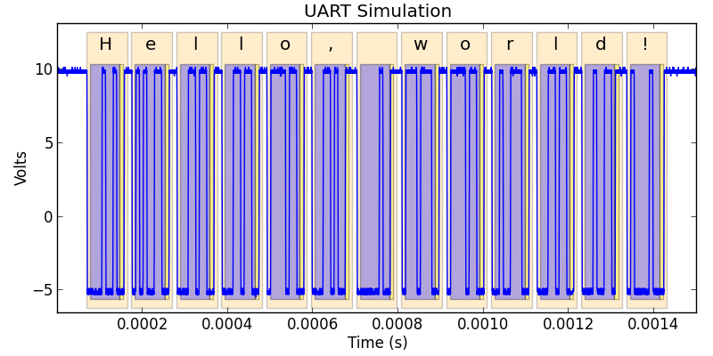
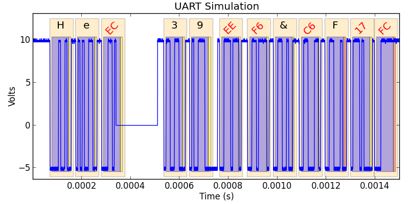
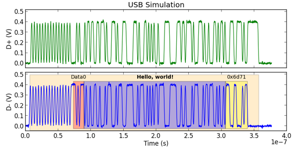

==========================
Getting started with Ripyl
==========================

This is a general overview of the Ripyl library. It will give you a feel for what Ripyl can do for you.

Ripyl demonstration
-------------------

Why use Ripyl?
~~~~~~~~~~~~~~

If you have a need to analyze captured serial data then Ripyl can transform it into a usable format. Many digital oscolloscopes and logic analyzers lack built in protocol decoders, only have then available as expensive add-ons, or lack support for a specific protocol. Manually decoding waveforms is error prone and not practical on a large scale. Ripyl solves these issues for you.

Ripyl is not a complete replacement for oscilloscope based protocol decoders. Most significantly, it only provides offline analysis of data. This means that there is no way to trigger on high level protocol events such as those provided in oscilloscope based decoders (data patterns, error conditions, etc.). Depending on your oscilloscope or analyzer, you may have advanced triggers available that can help you capture what you need but they will always be more limited than what is provided by built-in decoders. Due to this limitation, Ripyl will be most useful with data captured from deep memory oscilloscopes and analyzers.
  

Once you have :doc:`installed Ripyl <installation>` you are ready to use it in Python scripts that will decode serial data for you. The installer created an executable script called ``ripyl_demo`` that can be used to get a feel for what Ripyl does.

.. code-block:: sh

  > ripyl_demo -p uart
  
This will display some information about the parameters used for the UART protocol and the sampling of the internal synthesizer. If the decode was successful the "Decoded message:" will display the original message encoded in the protocol. If `matplotlib <http://matplotlib.org/>`_ is installed you will also see a plot of the simulated UART waveform annotated with graphics showing the location of frames, data bits (blue) and parity bits (yellow or red).

We can make changes to the synthesized waveform to explore the effect it has on Ripyl.

.. code-block:: sh

  > ripyl_demo -p uart -d "3.4e-4, 5.1e-4"
  

The dropout option (-d) forces the synthesized waveform to a fixed level between the specified start and end times. This causes errors in the decode process which show up in the plotted results. You can see that dropout introduces parity and framing errors that force the decoder out of sync with the correct data. The decoder may or may not recover on its own. This is an inherent issue with the decoding of corrupt UART signals and not a failure specific to Ripyl.

You can examine all of the protocols supported by Ripyl with ``ripyl_demo -h``. The available protocols are:

can
  Component Area Network
i2c
  Inter-IC (I\ :sup:`2`\ C) bus
kline
  ISO9141 and ISO14230 "K-line" automotive interfaces
lin
  Local Interconnect Network
nec
  NEC infrared protocol
ps2
  PS/2 and AT keyboard protocol
rc5, rc6
  Philips RC-5 and RC-6 infrared protocols
sirc
  Sony SIRC infrared protocol
spi
  Serial Peripheral Interface
uart
  Asynchronous serial
usb, usb-diff, hsic
  USB 2.0 with support for differentially probed input and the High Speed IC variant

Here is the test message encoded as a USB data packet:

.. code-block:: sh

  > ripyl_demo -p usb
  

The packet is shown with the PID (Data0), data payload, and checksum (0x6d71).

The ripyl_demo script has a variety of command line options. You can list them with the -h switch:

-h, --help            show this help message and exit
-p PROTOCOL, --protocol=PROTOCOL  Specify protocol to use
-n, --no-plot         Disable matplotlib plotting
-m MSG, --msg=MSG     Input message
-s SNR_DB, --snr=SNR_DB  SNR in dB
-b BAUD, --baud=BAUD  Baud rate
-o SAVE_FILE, --save-plot=SAVE_FILE  Save plot to image file
-d DROPOUT, --dropout=DROPOUT  Dropout signal from "start,end[,level]"
-t TITLE, --title=TITLE  Title for plot
-f FIGSIZE, --figsize=FIGSIZE  Figure size (w,h) in inches
-l, --label-names     Show field names for text labels
-a, --no-annotation   Disable plot annotation

