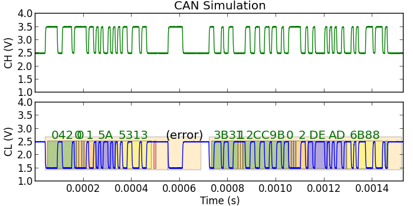
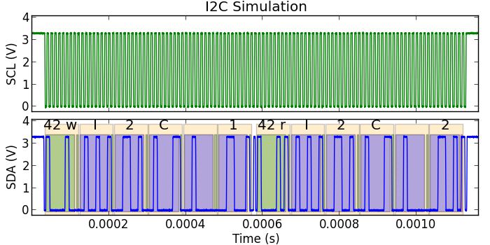
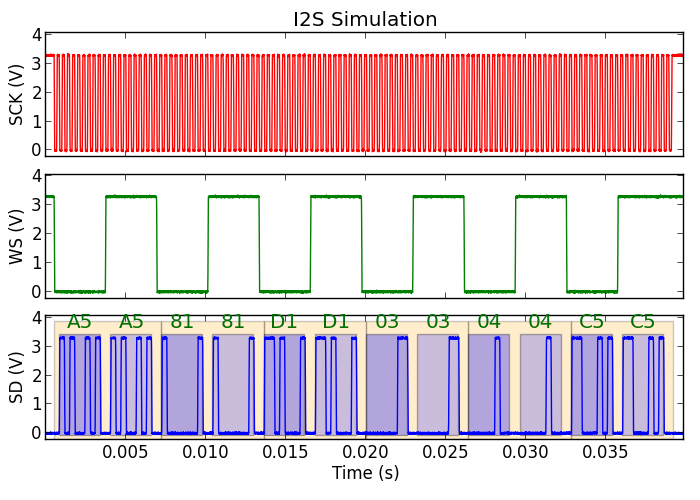
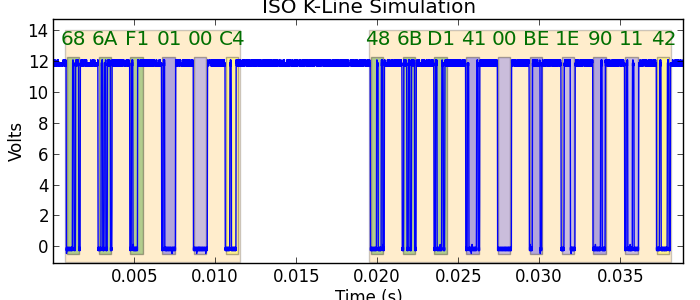
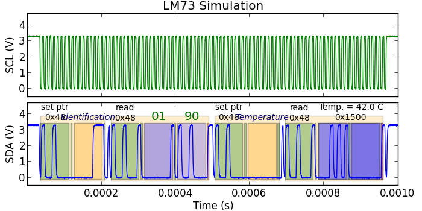
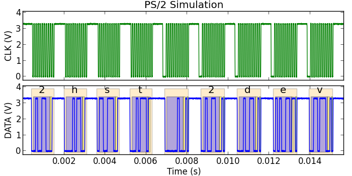
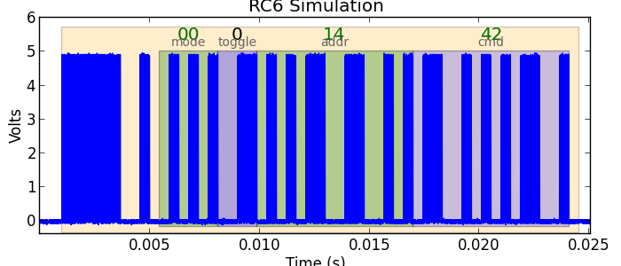
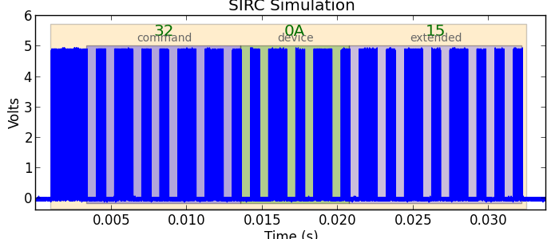
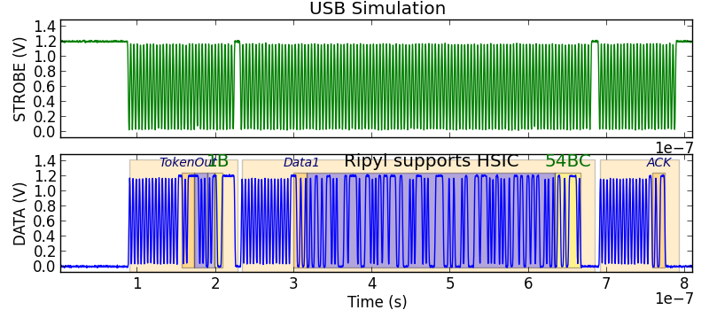

===============
Ripyl protocols
===============

The Ripyl library supports a number of protocols for decoding. Protocol decoders can be layered on top of each other. This creates a distinction between base level decoders that operate on raw sample or edge data and higher level decoders that work with the results of a lower level decoder.

The base protocols provided with Ripyl are the following:

* General purpose
    * :ref:`Ethernet`
    * :ref:`I2C <i2c>` (also handles SMBus)
    * :ref:`I2S <i2s>`
    * :ref:`PS/2 <ps2>`
    * :ref:`SPI <spi>`
    * :ref:`UART <uart>`
    * :ref:`USB 2.0 <usb>` (all speeds and HSIC support)
* Automotive
    * :ref:`CAN <can>`
    * :ref:`J1850 <j1850>` (Both VPW and PWM variants)
    * :ref:`LIN <lin>`
    * :ref:`ISO K-line <kline>` (ISO 9141 and ISO 14230)
* Infrared
    * :ref:`NEC <nec>`
    * :ref:`RC5 <rc5>`
    * :ref:`RC6 <rc6>`
    * :ref:`SIRC <sirc>`

All base level protocols in the library have functions to support the synthesis of arbitrary waveforms. This can be useful for testing or recreating special circumstances that would be challenging to perform with real hardware.

The higher level protocols provided with Ripyl are:

* :ref:`I2C transaction <i2c>`
* :ref:`LM73 <lm73>` temperature sensor (SMBus)
* :ref:`OBD-2 <obd2>` automotive ECU message format
* :ref:`USB transaction <usb-trans>`

The protocol decoders do not check timing parameters to verify that they meet specifications. The emphasis is on getting usable data out of waveforms even if they depart from requirements.

.. _can:

CAN
---

The :mod:`can <.protocol.can>` module decodes the CAN protocol. It supports 11-bit and 29-bit identifiers.

.. _ethernet:

Ethernet
--------

+-------------------------------------------------+----------------------------------------------------+
| .. figure:: ../image/example/ethernet_start.png | .. figure:: ../image/example/ethernet_end.png      |
|     :scale: 50%                                 |     :scale: 50%                                    |
|                                                 |                                                    |
|     Start of 10base-T frame                     |     End of 10base-T frame                          |
+-------------------------------------------------+----------------------------------------------------+

The :mod:`ethernet <.protocol.ethernet>` module decodes the Ethernet protocol. It supports 10base-T encoding and frames with 802.1Q and 802.1ad tags.

.. _i2c:

I\ :sup:`2`\ C
--------------

The :mod:`i2c <.protocol.i2c>` module decodes the I\ :sup:`2`\ C and SMBus protocols. This module includes a :func:`~.reconstruct_i2c_transfers` function that can group decoded :class:`~.I2CAddress` and :class:`.I2CByte` objects into messages.

.. _i2s:

I\ :sup:`2`\ S
--------------

DSP modes:

+-------------------------------------------------+----------------------------------------------------+
| .. figure:: ../image/example/i2s_example_lp.png | .. figure:: ../image/example/i2s_example_sp.png    |
|     :scale: 40%                                 |     :scale: 40%                                    |
|                                                 |                                                    |
|     DSP mode long sync pulse                    |     DSP mode short sync pulse (mono)               |
+-------------------------------------------------+----------------------------------------------------+

The :mod:`i2s <.protocol.i2s>` module decodes the I\ :sup:`2`\ S protocol. It includes support for the original I\ :sup:`2`\ S standard as well as two DSP mode variants with long and short pulse widths on the WS line. The decoder has a number of configurable parameters to support a variety of I\ :sup:`2`\ S implementations including control over polarities, data delays, and number of channels.

.. _kline:

ISO K-line (ISO 9141 and ISO 14230)
-----------------------------------

The :mod:`iso_k_line <.protocol.iso_k_line>` module decodes the ISO 9141 and ISO 14230 (KWP2000) automotive protocols. It supports slow and fast init sequences and 3 or 4-byte headers.

.. _j1850:

J1850
-----

+----------------------------------------------+----------------------------------------------------+
| .. figure:: ../image/example/j1850_vpw.png   | .. figure:: ../image/example/j1850_pwm.png         |
|     :scale: 50%                              |     :scale: 50%                                    |
|                                              |                                                    |
|     VPW protocol                             |     PWM protocol                                   |
+----------------------------------------------+----------------------------------------------------+

The :mod:`j1850 <.protocol.j1850>` module decodes the J1850 automotive protocols. Both the 10.4Kbps Variable Pulse Width (VPW) and 41.6Kbps Pulse Width Modulation (PWM) variants are supported.

.. _lin:

LIN
---

.. image:: ../image/example/lin_example.png
    :scale: 60%

The :mod:`lin <.protocol.lin>` module decodes the LIN (Local Interconnect Network) automotive protocol. It supports LIN 1.3 and 2.x style checksums.

.. _lm73:

LM73
----

The :mod:`lm73 <.protocol.lm73>` module decodes the SMBus protocol for the LM73 temperature sensor.

.. _nec:

NEC Infrared
------------

+----------------------------------------------+----------------------------------------------------+
| .. figure:: ../image/example/nec_example.png | .. figure:: ../image/example/nec_nomod_example.png |
|     :scale: 50%                              |     :scale: 50%                                    |
|                                              |                                                    |
|     Modulated NEC protocol                   |     Unmodulated NEC protocol                       |
+----------------------------------------------+----------------------------------------------------+

The :mod:`nec <.protocol.infrared.nec>` module decodes the NEC infrared protocol. It supports modulated (38kHz) and unmodulated input signals. It can decode the original protocol with an 8-bit address and the extended variant with a 16-bit address.

.. _obd2:

OBD-2
-----

The :mod:`obd2 <.protocol.obd2>` module provides general support for automotive ECU protocols.

.. _ps2:

PS/2
----

The :mod:`ps2 <.protocol.ps2>` module decodes the PS/2 and AT keyboard protocols.

.. _rc5:

Philips RC-5 Infrared
---------------------

.. image:: ../image/example/rc5_example.png
    :scale: 60%

The :mod:`rc5 <.protocol.infrared.rc5>` module decodes the Philips RC-5 infrared protocol. It supports modulated (36kHz) and unmodulated input signals. This decoder supports the original RC-5 protocol (6 command bits) and the RC5X extension (7 command bits).

.. _rc6:

Philips RC-6 Infrared
---------------------

The :mod:`rc6 <.protocol.infrared.rc6>` module decodes the Philips RC-6 infrared protocol. It supports modulated (36kHz) and unmodulated input signals. The full RC-6 protocol is not publicly documented. This decoder only supports mode-0 and partially supports mode-6 (RC6A).

.. _sirc:

Sony SIRC Infrared
------------------

The :mod:`sirc <.protocol.infrared.sirc>` module decodes the Sony SIRC infrared protocol. It supports modulated (40kHz) and unmodulated input signals. All three command formats are supported: 12-bit, 15-bit, and 20-bit.

.. _spi:

SPI
---

.. image:: ../image/example/spi_example.png
    :scale: 60%

The :mod:`spi <.protocol.spi>` module decodes the SPI and Microwire protocols. The chip select signal is optional. It only decodes a single data line (MISO or MOSI) at a time. To handle both you must run the decoder twice and merge the decoded StreamRecord objects together.

.. _uart:

UART
----

.. image:: ../image/example/uart_example.png
    :scale: 60%

The :mod:`uart <.protocol.uart>` module decodes asynchronous serial protocols. It provides automatic baud rate detection and flexible configuration for varying protocol parameters. It only decodes a single data line (txd or rxd) at a time. To handle both you must run the decoder twice and merge the decoded StreamRecord objects together.

.. _usb:

USB 2.0
-------

+---------------------------------------------------+----------------------------------------------------+
| .. figure:: ../image/example/usb_fs_example.png   | .. figure:: ../image/example/usb_hs_example.png    |
|     :scale: 50%                                   |     :scale: 50%                                    |
|                                                   |                                                    |
|     Full-speed USB (12Mb/s, differential probing) |     High-speed USB (480Mb/s, differential probing) |
+---------------------------------------------------+----------------------------------------------------+

The :mod:`usb <.protocol.usb>` module decodes USB 2.0 and HSIC protocols. This module provides full support for USB 2.0 including all three bus speeds (1.5, 12, and 480 Mb/s), extended packets, and mixed Full-speed and Low-speed packets. The decoder works with data collected from separate single-ended probes on the D+ and D- channels as well as that collected with a differential probe across D+ and D-. Bus speed is automatically detected.

.. figure:: ../image/example/usb_mix_example.png
    :scale: 50%

    Mixed Full (12Mb/s) and Low (1.5Mb/s) speed packets as in USB 1.1

.. figure:: ../image/example/usb_data_hs_example.png
    :scale: 60%

    High-speed USB (single-ended probing)

.. _hsic:

HSIC
~~~~

The USB decoder also provides support for the HSIC variant with single-ended strobe and data signals in place of the normal D+ and D- signals.

.. _usb-trans:

USB transactions
~~~~~~~~~~~~~~~~

The :mod:`usb_transact <.protocol.usb_transact>` module groups the packets generated by the USB and HSIC decoders into transactions.

