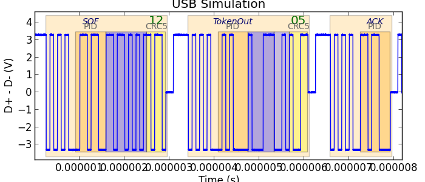

===============
Ripyl protocols
===============

The Ripyl library supports a number of protocols for decoding. Protocol decoders can be layered on top of each other. This creates a distinction between base level decoders that operate on raw sample or edge data and higher level decoders that work with the results of a lower level decoder.

The base protocols provided with Ripyl are the following:

* :ref:`I2C <i2c>` (also handles SMBus)
* :ref:`ISO K-line <kline>` (ISO 9141 and ISO 14230 automotive protocols)
* :ref:`NEC <nec>`
* :ref:`PS/2 <ps2>`
* :ref:`RC5 <rc5>`
* :ref:`RC6 <rc6>`
* :ref:`SIRC <sirc>`
* :ref:`SPI <spi>`
* :ref:`UART <uart>`
* :ref:`USB 2.0 <usb>` (all speeds and HSIC support)

All base level protocols in the library have functions to support the synthesis of arbitrary waveforms. This can be useful for testing or recreating special circumstances that would be challenging to perform with real hardware.

The higher level protocols provided with Ripyl are:

* :ref:`LM73 <lm73>` temperature sensor (SMBus)
* :ref:`OBD-2 <obd2>` automotive ECU message format

The protocol decoders do not check timing parameters to verify that they meet specifications. The emphasis is on getting usable data out of waveforms even if they depart from requirements.

.. _i2c:

I\ :sup:`2`\ C
--------------

.. image:: ../image/example/i2c_example.png
    :scale: 60%

The :mod:`i2c <.protocol.i2c>` module decodes the I\ :sup:`2`\ C and SMBus protocols.

.. _kline:

ISO K-line (ISO 9141 and ISO 14230)
-----------------------------------

.. image:: ../image/example/kline_example.png
    :scale: 60%

The :mod:`iso_k_line <.protocol.iso_k_line>` module decodes the ISO 9141 and ISO 14230 automotive protocols.

.. _lm73:

LM73
----

The :mod:`lm73 <.protocol.lm73>` module decodes the SMBus protocol for the LM73 temperature sensor.

.. _nec:

NEC Infrared
------------

+----------------------------------------------+----------------------------------------------------+
| .. figure:: ../image/example/nec_example.png | .. figure:: ../image/example/nec_nomod_example.png |
|     :scale: 60%                              |     :scale: 60%                                    |
|                                              |                                                    |
|     Modulated NEC protocol                   |     Demodulated NEC protocol                       |
+----------------------------------------------+----------------------------------------------------+

The :mod:`nec <.protocol.infrared.nec>` module decodes the NEC infrared protocol. It supports modulated (38kHz) and unmodulated input signals.

.. _obd2:

OBD-2
-----

The :mod:`obd2 <.protocol.obd2>` module provides general support for automotive ECU protocols.

.. _ps2:

PS/2
----

.. image:: ../image/example/ps2_example.png
    :scale: 60%

The :mod:`ps2 <.protocol.ps2>` module decodes the PS/2 and AT keyboard protocols.

.. _rc5:

Philips RC-5 Infrared
---------------------

.. image:: ../image/example/rc5_example.png
    :scale: 60%

The :mod:`rc5 <.protocol.infrared.rc5>` module deecodes the Philips RC-5 infrared protocol.

.. _rc6:

Philips RC-6 Infrared
---------------------

.. image:: ../image/example/rc6_example.png
    :scale: 60%

The :mod:`rc6 <.protocol.infrared.rc6>` module deecodes the Philips RC-6 infrared protocol.

.. _sirc:

Sony SIRC Infrared
------------------

.. image:: ../image/example/sirc_example.png
    :scale: 60%

The :mod:`sirc <.protocol.infrared.sirc>` module decodes the Sony SIRC infrared protocol.

.. _spi:

SPI
---

.. image:: ../image/example/spi_example.png
    :scale: 60%

The :mod:`spi <.protocol.spi>` module decodes the SPI protocol.

.. _uart:

UART
----

.. image:: ../image/example/uart_example.png
    :scale: 60%

The :mod:`uart <.protocol.uart>` module decodes asynchronous serial protocols.

.. _usb:

USB 2.0
-------

.. image:: ../image/example/usb_hs_example.png
    :scale: 60%

.. image:: ../image/example/usb_mix_example.png
    :scale: 60%

.. image:: ../image/example/usb_data_hs_example.png
    :scale: 60%

.. image:: ../image/example/hsic_example.png
    :scale: 60%

The :mod:`usb <.protocol.usb>` module decodes USB 2.0 and HSIC protocols.

