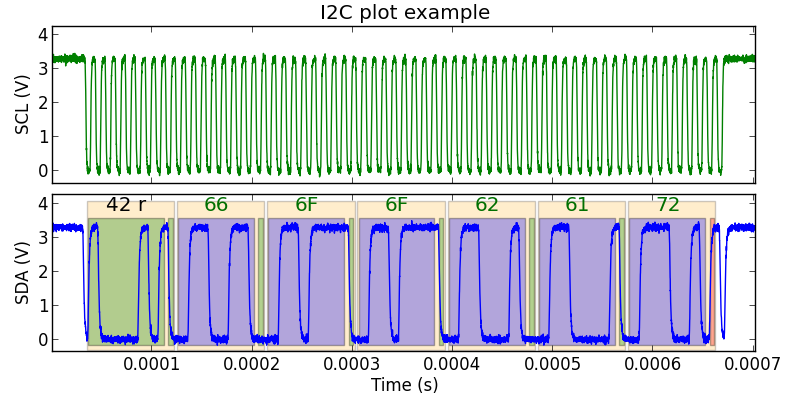

=======================
Ripyl plotting tutorial
=======================

This tutorial provides an overview of plotting with Ripyl.

The Ripyl library comes with a demo program that can plot examples of each supported protocol. It is possible to use the same plotting facilities to plot your own data if needed. The optional `matplotlib <http://matplotlib.org/>`_ library must be installed to plot waveforms with Ripyl.

Get sampled data
----------------

For this example we will generate some synthesized I2C waveforms to plot with. This step can be skipped if you already have sampled waveforms ready to plot.

.. code-block:: python

    import ripyl.sigproc as sigp
    import ripyl.streaming as stream
    import ripyl.protocol.i2c as i2c

    def sim_i2c():
        # I2C params
        clock_freq = 100.0e3
        
        # Sampled waveform params
        sample_rate = clock_freq * 100.0
        rise_time = sigp.min_rise_time(sample_rate) * 10.0 # 10x min. rise time
        noise_snr = 30.0
        
        message = 'foobar'
        byte_msg = bytearray(message.encode('latin1')) # Get raw bytes as integers
        
        transfers = [i2c.I2CTransfer(i2c.I2C.Read, 0x42, byte_msg)]

        # Synthesize the waveform edge stream
        scl, sda = i2c.i2c_synth(transfers, clock_freq, idle_start=3.0e-5, idle_end=3.0e-5)

        # Convert to a sample stream with band-limited edges and noise
        cln_scl_it = sigp.synth_wave(scl, sample_rate, rise_time, tau_factor=0.7)
        cln_sda_it = sigp.synth_wave(sda, sample_rate, rise_time, tau_factor=1.5)

        # Add noise and gain    
        noisy_scl_it = sigp.amplify(sigp.noisify(cln_scl_it, snr_db=noise_snr), gain=3.3, offset=0.0)
        noisy_sda_it = sigp.amplify(sigp.noisify(cln_sda_it, snr_db=noise_snr), gain=3.3, offset=0.0)

        # Capture the samples from the iterator
        noisy_scl = list(noisy_scl_it)
        noisy_sda = list(noisy_sda_it)

        return (noisy_scl, noisy_sda)

The Ripyl Plotter object needs sample streams as the waveform source(s). If you are getting samples from an external source you must convert them to a :ref:`sample stream <streams>` with the :func:`~.streaming.samples_to_sample_stream` function.

.. code-block:: python

    # Get scl_samples and sda_samples from external source
    noisy_scl = stream.samples_to_sample_stream(scl_samples, sample_period)
    noisy_sda = stream.samples_to_sample_stream(sda_samples, sample_period)

Plot waveforms
--------------

Once the sample streams are prepared you are ready to plot. The StreamRecords produced by the protocol decoders contain annotation information useful for plotting. Ripyl provides a :class:`~.Plotter` class that encapsulates a matplotlib figure and handles layout and annotation formatting. You prepare a plot with the :meth:`~.Plotter.plot` method, providing a dict of channel definitions with the waveform samples, any decoded records for annotation, and the title for the plot. Once the ``Plotter`` object is prepared you can either show the result in a matplotlib window or save it to a file.

.. code-block:: python

    import matplotlib
    import ripyl.util.plot as rplot
    from collections import OrderedDict

    noisy_scl, noisy_sda = sim_i2c() # Generate simulated sample streams

    # The decoded records contain annotation information
    records = list(i2c.i2c_decode(iter(noisy_scl), iter(noisy_sda)))

    # Define the channels ordered from top to bottom with the y-axis labels
    channels = OrderedDict([('SCL (V)', noisy_scl), ('SDA (V)', noisy_sda)])
    title = 'I2C plot example'

    # The Plotter object formats the samples and annotations into plotted waveforms
    plotter = rplot.Plotter()
    plotter.plot(channels, records, title, label_format=stream.AnnotationFormat.Text)
    plotter.show() # Show the plot in a matplotlib window

This produces an interactive plot window:

.. image:: ../image/plotting_tut1.png
    :scale: 75%

You can save the plot to a file instead:

.. code-block:: python

    # Write PNG image of 8x4 inches (800x400 @ 100dpi)
    plotter.save_plot('i2c.png', (8.0, 4.0))

.. image:: ../image/plotting_tut2.png
    :scale: 60%

The :meth:`~.Plotter.plot` method has a ``label_format`` parameter that controls the default format for the annotation text labels. The available formats are defined in the :class:`~.AnnotationFormat` enum:

Hidden
    Invisible text label. Only the colored rectangle is drawn

Invisible
    Invisible text label and rectangle

String
    Record data attribute is treated as a string

Text
    Record data attribute is a sequence of characters

Int
    Label as integers (default)

Hex
    Label as hexadecimal

Bin
    Label as binary

Small
    Same as String but with smaller text

The ``label_format`` parameter only affects fields that have been annotated to have a general purpose format. Changing the format to Hex produces the following result. Note that the address portion and the ack bits retain their formatting as String and Hidden.

.. code-block:: python

    plotter.plot(channels, records, title, label_format=stream.AnnotationFormat.Hex)

